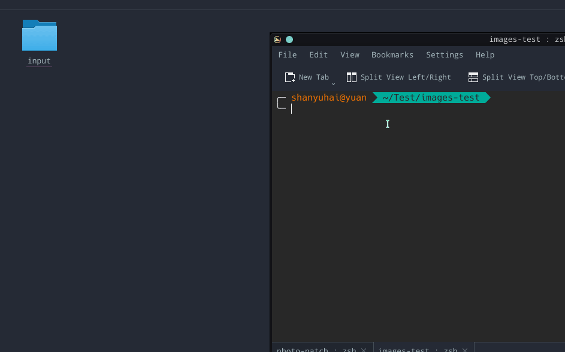

# PHOTO PATCH

填补你的图片。


## 配置项

| 字段            | 说明         | 默认值       |
| --------------- | ------------ | ------------ |
| CANVAS_SIZE     | 画布宽高     | 500*500      |
| CANVAS_BG_COLOR | 画布背景色   | #fff         |
| EXTS            | 过滤图片类型 | png,jpg,jpeg |


## 使用

默认使用：

```bash
docker run --rm \
  -v `pwd`/input:/home/node/app/input \
  -v `pwd`/output:/home/node/app/output \
  shanyuhai/photo-patch
```

修改画布大小及背景色：

```bash
docker run --rm \
  -e CANVAS_SIZE='600*400' \
  -e CANVAS_BG_COLOR=#525288 \
  -v `pwd`/input:/home/node/app/input \
  -v `pwd`/output:/home/node/app/output \
  shanyuhai/photo-patch
```


